# SDD Orchestrator

Python coordinates external agent CLIs. Agents produce and inspect artifacts; Python owns transitions, retries, persistence, command policy, and deterministic verification. A model response cannot override a failing test, build, lint, or static check.

## Architecture

```mermaid
flowchart TD
  F[Feature request] --> C[Constitution]
  C --> CV[Constitution validator]
  CV --> S[Specification]
  S --> SV[Specification validator]
  SV --> P[Plan]
  P --> PV[Plan validator]
  PV --> T[Tasks]
  T --> TV[Tasks validator]
  TV --> X[Cross artifact validation and traceability]
  X --> A[Analyze]
  A --> D[TestDesigner: RED]
  D --> V[TestValidator checks task test contract]
  V --> R[Python runs only declared task tests and classifies RED]
  R --> RS[Independent validator checks RED semantics]
  RS --> G[Coder: GREEN with test hashes protected]
  G --> GV[Task tests, then regression]
  GV --> RF[Refactor]
  RF --> RV[Regression verification]
  RV --> CR[Independent code review]
  CR --> B[Build and full tests]
  B --> LS[Ruff, mypy and syntax checks]
  LS --> Q[Requirement checks]
  Q --> H[Final reviewer after deterministic PASS]
  H --> CP[Durable checkpoint and next task]
  CP --> RES[Resume: fingerprint and last gate revalidation]
  RES -->|clean or safe| CP
  RES -->|unsafe| STOP[Inspect, abort or explicit reconciliation]
```



The TDD state machine is explicit in `orchestrator/workflow/transitions.py`; `TDDGate` enforces task evidence in `orchestrator/tdd.py`. The workflow completes only after the final deterministic harness and reviewer pass. SHA-256 snapshots protect tests, fixtures and test configuration during GREEN and refactoring. Test types include `UNIT`, `INTEGRATION`, `HARDWARE`, and `NOT_AUTOMATABLE`; hardware work must not be reported as PASS without target evidence.

## Install

Requires Python 3.10+. From the repository root:

```sh
python -m pip install -e '.[dev]'
python -m orchestrator configure
```

`configure` creates `orchestrator.yaml` and `models.yaml` only when absent. It inspects project markers and catalogs, then writes reviewable suggestions. JSON syntax inside `.yaml` files works with Python's standard library; traditional YAML requires PyYAML. The checked-in configuration uses JSON syntax and works without installing PyYAML. Normal tests do not call agent CLIs.

## Discover providers

```sh
python -m orchestrator doctor
python -m orchestrator models
python -m orchestrator doctor --live --verbose # optional: basic and structured check per provider
```

`doctor` probes `agy --output-format json models` (with table fallback), `opencode models --refresh` and `--verbose`, and `codex debug models`. It saves provider and model metadata to `.orchestrator/capabilities.json` and `.orchestrator/models.json`, then writes `.orchestrator/model-selection.md`. Failed catalog probes retain the last successful catalog for the same CLI version and record the failure. `doctor` reports unresolved CLI defaults, heuristic tier choices and missing verification gates. `models` shows each model's tier source and available history; unavailable facts appear as `unknown`. `doctor --live` is the only doctor mode that calls models. It runs separate basic and structured checks in disposable Git workspaces. `--verbose` shows execution, exit code, parsing, contract and failure classification; a failed structured check leaves a passing basic provider available with `structured_output=degraded`.

## Plan and execute

```sh
python -m orchestrator run --feature-file feature.md --dry-run
python -m orchestrator run --feature-file feature.md --interactive
python -m orchestrator run --feature "Add an export endpoint"
python -m orchestrator run --feature-file feature.md --first-real-run --worktree
python -m orchestrator workflows
python -m orchestrator status WORKFLOW_ID
python -m orchestrator inspect WORKFLOW_ID
python -m orchestrator checkpoints WORKFLOW_ID
python -m orchestrator resume WORKFLOW_ID --interactive
python -m orchestrator abort WORKFLOW_ID
python -m orchestrator trace FR-018
python -m orchestrator metrics --role coder --provider opencode
python -m orchestrator route explain coder --task T018
```

Dry-run prints workflow roles, explicit provider/model IDs, tier, `tier_source`, base and historical evidence, `selected_by_policy`, `historical_recommendation`, independence, fallback chain, configured verification commands and separate suggestions. It does not create workflow state or invoke agents. `--coder-provider` overrides the coder route. SQLite workflow state and run evidence live under `.orchestrator/`.

`run` drives artifact generation and independent validation sequentially, then runs the TDD task driver. It expects `tasks.md` to contain validated JSON tasks with requirement IDs, acceptance criterion IDs, plan decisions, dependencies and narrow `allowed_files` for production edits. The TestDesigner returns task-specific test IDs and command arrays. `--interactive` shows stage, role, planned provider/model, expected file changes and commands at each gate; choose `continue`, `inspect` or `abort`. The CLI does not auto-change an existing constitution. `--first-real-run` forces interactive gates, strict safety and `observe` routing. `--worktree` creates a dedicated branch and isolated worktree under the system temporary directory after checking that the source worktree is clean. The workflow records that path for resume.

## Providers and routing

Adapters in `orchestrator/providers/` implement the shared provider interface and contain CLI-specific process construction. Validators receive read-only permissions where the CLI supports them; Codex uses `read-only` for validator roles and `workspace-write` for coding roles. Provider failure can fall back to another discovered provider. Task failures are not provider fallback conditions. The router supports provider/model overrides and category configuration in `orchestrator.yaml`.

Routing filters required capabilities and provider availability, applies author independence, role preferences and model tier fit as a **base score**. `models.yaml` maps discovered IDs to tiers; `orchestrator.yaml` maps roles to tiers and provider preferences. Per-model tier evidence follows `config > provider_metadata > history > heuristic > cli_default`. The name heuristic is a last resort and ignores provider prefixes. A CLI default is used only when model selection or a catalog is unavailable, or `use_cli_default: true` is configured. `prefer_different_provider_from` controls independence per role; `false` is recorded if only one compatible provider remains. OpenCode agent names can be mapped through `providers.opencode.agent_map`; orchestrator role names are never passed as installed agent names automatically.

## Empirical routing

Every provider execution records provider, model, role, deterministic task type and complexity, workflow/task IDs, latency, attempts and outcome fields in SQLite. Completed TDD stages add RED, GREEN, regression, review and tampering outcomes. `metrics` accepts `--role`, `--provider` and `--model`. `route explain ROLE [--task ID] [--workflow-id ID]` lists candidate capabilities, tier, base score, historical score, confidence, penalties, final score and selection. With a task ID, it reads validated `tasks.md` metadata when available; otherwise it labels the task context `id_only`.

Historical rates use exponential decay: a result aged `d` days has weight `2^(-d / decay_half_life_days)`. Confidence is `min(1, effective_samples / max(50, 5 × historical_min_samples)) × min(1, effective_samples / historical_min_samples)`. At zero samples confidence is zero; old samples lose influence without deleting evidence. Task type and complexity specific history is used once it has at least `historical_min_samples` records; otherwise the router uses provider/model/role history. Historical score is a transparent weighted combination of success, first pass success, latency, rejection, regression, blocked and provider failure rates. The final score adds `historical_score × confidence × mode_weight` to the base score. `mode_weight` is 0 in `observe` and 0.5 in `assist`; `adaptive` can be configured explicitly with weight 1 but is not enabled by default.

`observe` is the default: it calculates a historical recommendation and keeps the policy selection. `assist` lets mature evidence influence selection. Exploration in `assist` chooses a sufficiently close alternative at the configured rate, only when more than one compatible provider exists. It is disabled for constitution changes, high risk or blocked tasks, and manual overrides. Every route records `selection_mode=exploitation|exploration`. Historical scores are evidence from local executions, not an assertion that one model is universally better.

```yaml
routing:
  adaptive_routing_mode: observe
  historical_min_samples: 10
  decay_half_life_days: 30
  exploration_rate: 0.05
```

## Resume and integrity

Safe transitions write idempotent SQLite checkpoints with a transition ID, stage/substage, task/attempt, schema version, Git branch and HEAD, modified and relevant untracked paths, SDD artifact hashes, task code hashes and protected test hashes. Generated logs and cache files are classified as safe changes. `resume` acquires a workflow lock, compares the current fingerprint and classifies `CLEAN_MATCH`, `SAFE_DIVERGENCE`, `UNSAFE_DIVERGENCE`, `MISSING_FILES`, `BRANCH_CHANGED` or `BASE_CHANGED`. It then reruns the last deterministic gate: RED tests, GREEN task tests, refactor regression, task completion tests or final verification. A failed revalidation blocks the workflow. Validated artifacts and completed tasks are skipped when execution continues, so checkpoints, metrics and task commits are not duplicated. The current Git integration does not create automatic task commits.

An interrupted agent or verification command is never assumed successful. Resume returns to the last durable checkpoint. Interactive mode shows unsafe differences and offers `inspect`, `abort` or `reconcile`. Reconciliation can promote an interrupted GREEN or REFACTOR only if changes remain inside the task's declared production scope, protected tests and artifacts are unchanged, and task plus regression tests pass. Other divergence requires manual repair before another resume. `abort` marks the workflow `ABORTED` and retains code, logs, metrics, traceability and checkpoints. Stale locks from dead processes on the same host are reclaimed; live locks fail with `WORKFLOW_ALREADY_RUNNING`.

SQLite schema version 2 adds checkpoint, lock, outcome context and resume report tables. Older workflow rows are migrated and marked `LEGACY_NO_FINGERPRINT`; they cannot be resumed automatically without an original checkpoint. Each resume writes a report with the prior checkpoint, fingerprint status, differences, revalidation and next transition. A first real run remains interactive on subsequent resumes.

```sh
python -m orchestrator workflows
python -m orchestrator inspect WORKFLOW_ID
python -m orchestrator resume WORKFLOW_ID --interactive
python -m orchestrator abort WORKFLOW_ID
```

## Validation and TDD

Agent validation uses structured results (`PASS`, `REVISE`, `BLOCKED`). TestDesigner must return `task_id`, linked requirement and acceptance criterion IDs, `created_tests`, and task-specific `test_commands`. Python rejects a full-suite RED/GREEN command or a test ID that does not point to a changed test file. RED requires test discovery, a linked assertion failure and an independent semantic validation. Its classification is `EXPECTED_FAILURE`, `INVALID_TEST`, `INFRASTRUCTURE_FAILURE` or `UNEXPECTED_FAILURE`; only the first advances to GREEN. GREEN runs declared task tests first, then regression tests. Any change to protected test or fixture hashes is `TEST_TAMPERING` and blocks GREEN. TestValidator can approve a correction only with `REVISE` and `RETURN_TO_RED`; the task then enters `RED_GENERATE`, and the workflow stops for a formal new RED cycle. A non-TDD exception requires an independent approval and recorded alternative verification.

Each task writes `tdd.json` and `tdd.md` under `.orchestrator/runs/<workflow>/<task>/`. SQLite stores `TraceabilityRecord` entries linking requirement, acceptance criteria, plan decisions, task, test IDs, production files, verification results and final status. `trace [REQUIREMENT_ID]` queries them. `metrics` summarizes provider/model/role runs, success, retries, latency, structured output failures and validator rejections, plus RED/GREEN/regression/tampering rates. Routing behavior remains unchanged by these new metrics.

## Verification harness and safety

The harness suggests commands from Python, Node, Rust, Go, Make, CMake and PlatformIO markers, plus Ruff and mypy configuration. Detection does not authorize execution. Only commands in `orchestrator.yaml` run. `doctor` reports syntax, lint and type checking separately and warns if a configured tool is absent. Each result records name, category, command, exit code, output, duration and status. Commands use argument arrays, without `shell=True`; dangerous patterns and absolute paths outside the workspace are blocked. A failing build, test, lint, type, syntax or requirement check blocks final completion even if a reviewer says PASS.

```yaml
verification:
  task_tests: []
  regression_tests: [["python", "-m", "pytest", "-q"]]
  build: []
  tests: [["python", "-m", "pytest", "-q"]]
  lint: [["python", "-m", "ruff", "check", "orchestrator", "tests"]]
  type: [["python", "-m", "mypy"]]
  syntax: [["python", "-m", "compileall", "-q", "orchestrator", "tests"]]
  static: [] # legacy category
  requirements:
    - requirement_id: FR-018
      checks:
        - name: queue overflow
          command: ["python", "-m", "pytest", "-q", "tests/test_queue.py"]
```

The legacy `verification.tests` key remains valid and supplies regression tests when `regression_tests` is absent. Each configured requirement produces a `RequirementVerification` record; a failed or empty check set is `FAIL` or `BLOCKED`. The checked-in Python configuration uses `pip wheel`, pytest, Ruff, mypy and `compileall`. Mypy currently checks four typed core modules listed in `pyproject.toml`; it does not yet cover the entire package. Wheel building may need access to declared build dependencies when they are not cached.

Strict real runs require a Git repository and a clean working tree at startup. The task budget limits agent calls per task and workflow, retry count and elapsed wall time; counts persist across resume. Validators have an empty write scope, TestDesigner is limited to tests and fixtures, and Coder/Refactorer require each task's `allowed_files`. After every agent call, the orchestrator compares file hashes and blocks `SCOPE_VIOLATION` while retaining the changed files for inspection. The deterministic command policy blocks destructive harness commands and records commands executed during the workflow. The gate before each real agent call shows role, provider/model, task, permitted files and expected outputs. A safety block never resets or removes user files. Commands launched internally by a provider CLI are outside the Python harness's command interception; use `--worktree` and provider-native sandboxing for the first run. OpenCode does not expose a read-only permission flag in the detected adapter, so its validator safety is enforced by file diff after the call.

```yaml
real_run:
  safety_mode: strict
  max_agent_calls_per_task: 12
  max_agent_calls_per_workflow: 100
  max_retries: 3
  max_wall_time: 7200
  file_scopes:
    test_designer: [tests/, fixtures/]
    coder: task
    refactorer: task
    code_reviewer: []
```

## Example

```sh
printf '%s\n' 'Feature: add bounded retry to the queue. FR-018 requires retry attempts to stop at the configured limit. AC-018-01 verifies no extra attempt is made.' > /tmp/feature.md
python -m orchestrator run --feature-file /tmp/feature.md --dry-run
```

Run unit tests with `python -m pytest -q`. `python -m orchestrator verify` executes only configured deterministic commands. Provider smoke tests are opt-in through `doctor --live` and never run in the unit suite. Basic checks require `AGY_SMOKE_OK` in AGY plain stdout, `OPENCODE_SMOKE_OK` in OpenCode JSONL `type=text` events, and `CODEX_SMOKE_OK` in Codex plain stdout. Structured checks separately require a final JSON object with `ok=true`. OpenCode uses `--dir` to keep both checks inside its temporary workspace. AGY and OpenCode need access to their own files and local sockets; restricted operating-system sandboxes can prevent these CLIs from starting even when they work in a normal terminal. No end-to-end feature with real LLMs has been executed for this version; the first production run should use `--first-real-run`, ideally with `--worktree` after committing the current workspace.
