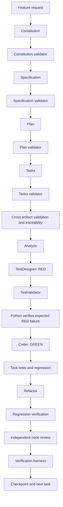

# SDD Orchestrator

Python coordinates external agent CLIs. Agents produce and inspect artifacts; Python owns transitions, retries, persistence, command policy, and deterministic verification. A model response cannot override a failing test, build, lint, or static check.

## Architecture



The TDD state machine is explicit in `orchestrator/workflow/transitions.py`; `TDDGate` enforces evidence requirements in `orchestrator/tdd.py`. A task cannot reach `COMPLETE` without validated tests, an expected RED failure, passing GREEN and regression, review, deterministic verification, and traceability. Test file snapshots support test tampering detection. Test types include arbitrary task metadata such as `UNIT`, `INTEGRATION`, `HARDWARE`, and `NOT_AUTOMATABLE`; hardware work must not be reported as PASS without target evidence.

## Install

Requires Python 3.10+. From the repository root:

```sh
python -m pip install -e '.[dev]'
cp orchestrator.example.yaml orchestrator.yaml
```

PyYAML is optional unless loading YAML configuration. Normal tests do not call agent CLIs.

## Discover providers

```sh
python -m orchestrator doctor
python -m orchestrator models
```

`doctor` probes `agy`, `opencode`, and `codex`, saves observed capabilities to `.orchestrator/capabilities.json`, and writes `.orchestrator/model-selection.md`. Missing CLIs and failed probes are reported as unavailable; no model name is required by the router. Tier routing is heuristic and reflects available capabilities/configuration, not an empirical claim of model quality.

## Plan and execute

```sh
python -m orchestrator run --feature-file feature.md --dry-run
python -m orchestrator run --feature "Add an export endpoint"
python -m orchestrator status
python -m orchestrator resume WORKFLOW_ID
```

Dry-run prints workflow roles, provider routes, validation gates, and detected/configured verification commands. It does not create workflow state or invoke agents. `--coder-provider` overrides the coder route. SQLite workflow state and run evidence live under `.orchestrator/`.

`run` drives artifact generation and independent validation sequentially, then runs the TDD task driver. It expects `tasks.md` to contain the validated JSON tasks array with a task-specific `test_command`; malformed or incomplete tasks block the workflow. The CLI deliberately does not auto-change an existing constitution. Creating a missing constitution requires an interactive human approval. `resume` currently displays persisted workflow state; automatic continuation from an interrupted stage is not yet implemented.

## Providers and routing

Adapters in `orchestrator/providers/` implement the shared provider interface and contain CLI-specific process construction. Validators receive read-only permissions where the CLI supports them; Codex uses `read-only` for validator roles and `workspace-write` for coding roles. Provider failure can fall back to another discovered provider. Task failures are not provider fallback conditions. The router supports provider/model overrides and category configuration in `orchestrator.yaml`.

## Validation and TDD

Agent validation uses strict structured results (`PASS`, `REVISE`, `BLOCKED`). The parser tolerates fenced or surrounded JSON but fails closed to `BLOCKED` when the contract is malformed. `TDDTask`, `TDDGate`, and `VerificationHarness.run_red` provide the enforcement primitives for a task driver. RED is valid only when a discovered test fails for an expected behavior; syntax, import, and infrastructure failures do not authorize GREEN. GREEN test diffs can be checked with `test_files_changed`. A deliberate non-TDD exception requires an independent policy/validator approval and a recorded alternative verification; the coder cannot self-authorize it.

## Verification harness and safety

The harness detects common Python, Node, Rust, Go, Make, CMake, and PlatformIO project markers, and accepts explicit command arrays in YAML. Commands run with argument arrays, without `shell=True`. Dangerous command patterns and absolute paths outside the workspace are blocked. Hardware-dependent verification must remain `AWAITING_HARDWARE_VALIDATION` when hardware is unavailable. Configure build, test, lint, and static commands explicitly where auto-detection is insufficient.

```yaml
verification:
  build: [["pio", "run"]]
  tests: [["python", "-m", "pytest", "-q"]]
  lint: []
  static: []
```

## Example

```sh
printf '%s\n' 'Feature: add bounded retry to the queue. FR-018 requires retry attempts to stop at the configured limit. AC-018-01 verifies no extra attempt is made.' > /tmp/feature.md
python -m orchestrator run --feature-file /tmp/feature.md --dry-run
```

Run unit tests with `python -m pytest -q`. Provider smoke tests are intentionally opt-in and must be added explicitly when CLI credentials and quota are available.
