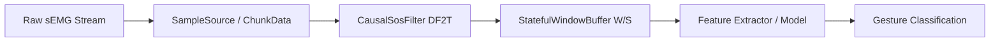

# Agents EMG — Causal Streaming DSP & Gesture Recognition Pipeline

An agentically-developed, mathematically rigorous surface electromyography (sEMG) processing and hand gesture recognition library.

Developed strictly under **Specification-Driven Development (SDD)** and **Test-Driven Development (TDD)** governed by the [SDD Orchestrator](https://github.com/AllissonChervenski/sdd_orchestrator) control plane.

---

## Architecture Overview



### Core Components

1. **`semg_dsp`**: 100% causal streaming digital signal processing pipeline:
   - **`ChunkData`**: Immutable multichannel sample container with float32 enforcement, metadata, and canonical hashing.
   - **`SampleSource` / `SyntheticSampleSource`**: Procedural analytical waveform generators (sine, impulse, step, DC, multi-tone, saturation) maintaining exact phase continuity across arbitrary chunk sizes.
   - **`CausalSosFilter`**: Direct Form II Transposed (DF2T) biquad cascade with internal state preservation and chunk invariance.
   - **`StatefulWindowBuffer`**: Sliding window buffer of length $W$ with stride $S$, bounded memory, and configurable partial-window finalize policies (`drop`, `pad`).
   - **`StreamingPipeline`**: End-to-end causal stream coordinator.

---

## Constitution & Numerical Integrity

This project is governed by [`.specify/memory/constitution.md`](.specify/memory/constitution.md):
- **Principle I & II**: Sole Python orchestrator authority and non-negotiable RED $\to$ GREEN $\to$ REFACTOR lifecycle with SHA-256 test anti-tampering protection (`TEST_TAMPERING`).
- **Principle VI (Scientific and Numerical Oracle Integrity)**: Dual-tier independent scientific oracles (closed-form analytical solutions and SciPy references) with frozen fixture hashes (`tests/fixtures/dsp/*.npz`). Zero self-generation of reference golden data.

---

## Verification & Quality Gates

Deterministic gates are enforced before any feature or task closure:

```bash
# Run sEMG test suite
python -m pytest -q

# Linting & static typing
python -m ruff check tests semg_dsp
python -m mypy
python -m compileall -q tests semg_dsp

# Full orchestrator verification
python -m orchestrator verify
```

---

## Specifications & Roadmap

Living documentation resides in `specs/`:
- **Feature 001**: Baseline architectural canary.
- **Feature 002**: `specs/002-dsp-streaming-pipeline` (**Completed & Verified**).
- **Feature 003**: `specs/003-dataset-contract-and-splits` (**In Progress**).
