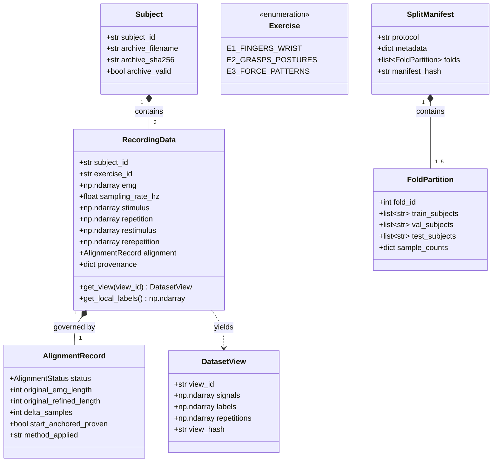

# Phase 1: Data Model — Feature 003

## Domain Entities & Invariants

---

### 1. `Subject`
- **Fields**:
  - `subject_id: str`: Formatted as `"S1"` through `"S40"`.
  - `archive_filename: str`: e.g. `"DB2_s1.zip"`.
  - `archive_sha256: str`: Hexadecimal SHA-256 digest of original ZIP.
  - `archive_valid: bool`: Boolean integrity status from `testzip()`.
- **Validation Rules**:
  - `subject_id` must match `^S([1-9]|[1-3][0-9]|40)$`.
  - `archive_sha256` must match the frozen hash in `file_inventory.jsonl`.

---

### 2. `Exercise`
- **Fields / Values**:
  - `E1`: 17 finger and wrist movements (global labels 1..17).
  - `E2`: 23 functional grasp and posture movements (global labels 18..40).
  - `E3`: 9 dynamic force patterns (global labels 41..49).
- **Validation Rules**:
  - Only `"E1"`, `"E2"`, and `"E3"` are valid exercise identifiers in NinaPro DB2.

---

### 3. `RecordingData`
- **Fields**:
  - `subject_id: str`: Subject identifier (`"S1"`..`"S40"`).
  - `exercise_id: str`: Exercise identifier (`"E1"`, `"E2"`, `"E3"`).
  - `emg: np.ndarray`: Shape `(N, 12)`, dtype `np.float32`.
  - `sampling_rate_hz: float`: Nominally `2000.0`.
  - `stimulus: np.ndarray`: Shape `(N,)`, dtype `np.int8`.
  - `repetition: np.ndarray`: Shape `(N,)`, dtype `np.int8`.
  - `restimulus: np.ndarray`: Shape `(N,)`, dtype `np.int8`.
  - `rerepetition: np.ndarray`: Shape `(N,)`, dtype `np.int8`.
  - `alignment: AlignmentRecord`: Details of temporal alignment applied.
  - `provenance: dict[str, Any]`: Citation, timestamps, hashes.
- **Invariants**:
  - `emg.ndim == 2 and emg.shape[1] == 12`
  - `emg.dtype == np.float32`
  - `not np.isnan(emg).any() and not np.isinf(emg).any()`
  - Length of `emg`, `stimulus`, `repetition`, `restimulus`, and `rerepetition` are strictly identical (`N`) after alignment.

---

### 4. `AlignmentRecord` & `AlignmentStatus`
- **Enums**:
  - `IDENTICAL`: No discrepancy detected; signals were identical length from the start.
  - `ANCHOR_START_TRUNCATE_TAIL`: Start anchoring was proven ($t=0$ synchrony); trailing samples truncated.
  - `QUARANTINE`: Discrepancy could not be proven to be tail-only or start anchor was ambiguous.
- **Fields**:
  - `status: AlignmentStatus`
  - `original_emg_length: int`
  - `original_refined_length: int`
  - `delta_samples: int`
  - `start_anchored_proven: bool`
  - `notes: str`

---

### 5. `DatasetView`
- **Fields**:
  - `view_id: str`: `"refined"` (default) or `"stimulus"` (secondary).
  - `signals: np.ndarray`: Aligned sEMG array `(N, 12)`.
  - `labels: np.ndarray`: Aligned gesture labels `(N,)`.
  - `repetitions: np.ndarray`: Aligned repetition counters `(N,)`.
  - `view_hash: str`: SHA-256 digest of view content for provenance.
- **Invariants**:
  - When `view_id == "refined"`: `labels` is `restimulus` and `repetitions` is `rerepetition`.
  - When `view_id == "stimulus"`: `labels` is `stimulus` and `repetitions` is `repetition`.
  - Pair mixing is impossible by construction.

---

### 6. `SplitManifest` & `FoldPartition`
- **Fields**:
  - `protocol: str`: `"within_subject"` or `"cross_subject"`.
  - `created_at: str`: ISO 8601 UTC timestamp.
  - `git_commit: str`: Repository commit hash.
  - `dataset_hash: str`: Consolidated hash of raw archives.
  - `folds: list[FoldPartition]`
- **Invariants**:
  - For any fold:
    $$\text{train\_subjects} \cap \text{val\_subjects} = \emptyset$$
    $$\text{train\_subjects} \cap \text{test\_subjects} = \emptyset$$
    $$\text{val\_subjects} \cap \text{test\_subjects} = \emptyset$$
  - In `within_subject`: `train_repetitions` $\cap$ `test_repetitions` $= \emptyset$.
